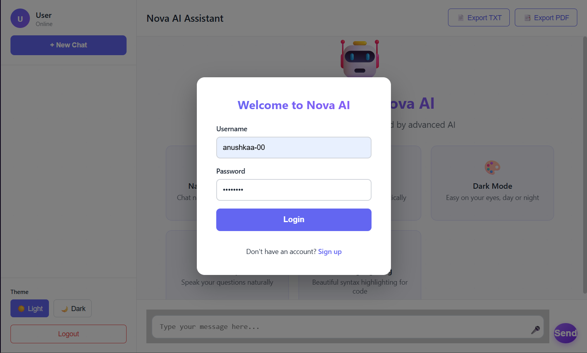
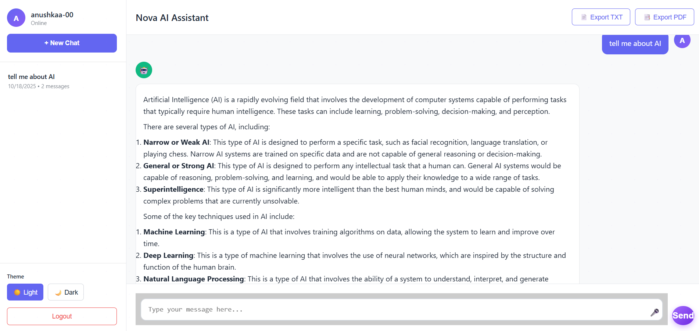
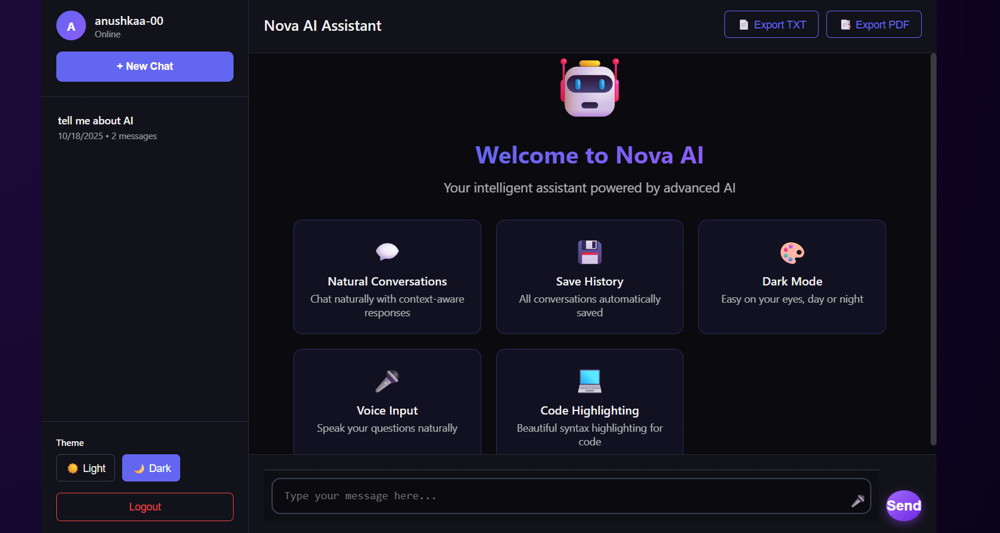
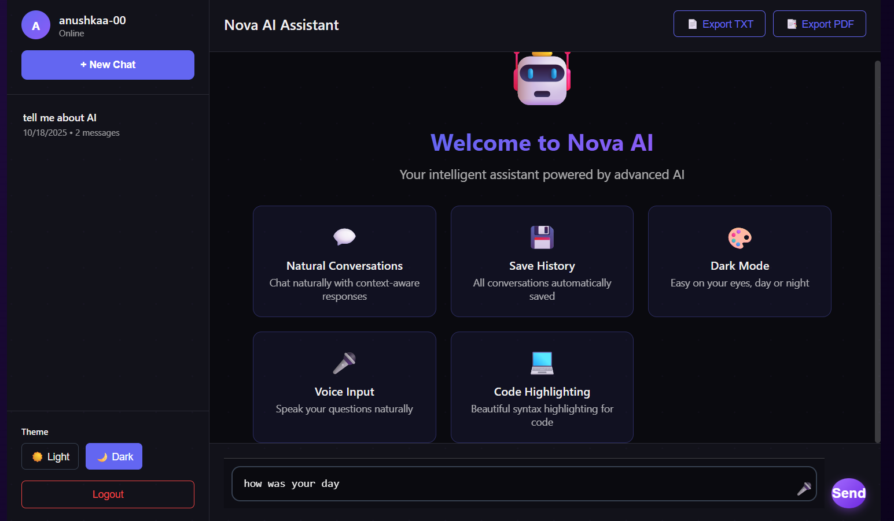

# Nova-AI

Nova-AI is an AI-powered assistant designed to intelligently respond to user queries, provide recommendations, and perform AI-driven tasks efficiently. It leverages modern AI models from Hugging Face and vector-based information retrieval for fast and accurate responses.

---

## Problem Statement

Interacting with AI systems can be complex and unintuitive. Nova-AI simplifies this by providing a user-friendly, web-based AI assistant that understands natural language and delivers accurate, context-aware responses in real-time.

---

## Tech Stack

- **Python** – Main programming language  
- **Flask** – Backend web framework  
- **HTML / CSS / JavaScript** – Frontend interface  
- **Hugging Face API** – AI-powered responses  
- **Vector Stores / LangChain** – Efficient query processing and embeddings  
- **Other libraries**: `numpy`, `requests`, `python-dotenv`, `faiss-cpu`, `gunicorn`, etc.

---

## Features

- **Natural Language Query Handling** – Ask questions and get AI-powered responses  
- **Mode Toggle** – Switch between light and dark themes for a better user experience  
- **Voice Input** – Speak to the assistant and receive responses
- **Export Chats** – Export the chats as txt or pdf  
- **Vector-Based Search** – Fast and context-aware information retrieval  
- **User-Friendly Web Interface** – Clean and responsive UI  
- **Extensible and Modular** – Easy to add new features or AI models  

---

## Screenshots / Demo

### Home Page

### Chat Interface

### Dark Mode & Voice Input
  

---

## Notes

- `.env` contains sensitive keys and is **not included** in the repository  
- The project can be further enhanced with multi-language support, advanced AI models, and additional personalization features  

---

## License

This project is licensed under the MIT License. See `LICENSE` for details.

---

⭐ If you like this project, give it a star!
